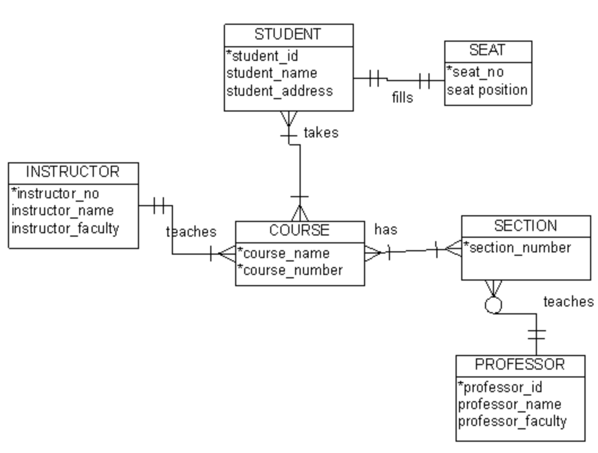

# Problem Set 7.2 - Intro to Relational Databases

### Directions
Fork and clone this repo. For this problem set, you will be working with the [Pagila](https://github.com/devrimgunduz/pagila) database. 

## Part I: SQL Challenges 
In `solutions.md`, write your solutions to the questions below. Also, include the SQL queries (formatted nicely, using a multi-line code snippet) that you used to obtain your answer.

1. What ~~percentage~~ total # of films have a rental rate of $0.99? 
341
2. What is the ~~percentage~~ breakdown of all films by rating? (Format this answer as a [table](https://github.com/adam-p/markdown-here/wiki/Markdown-Cheatsheet#tables) in Markdown)
3. Which actor appeared in the most films?
SELECT actor.actor_id,actor.first_name , actor.last_name, count(film_actor.actor_id)
FROM actor JOIN film_actor
ON actor.actor_id = film_actor.actor_id
GROUP BY actor.actor_id
ORDER BY count(film_actor.actor_id) DESC
LIMIT 1;
GINA
4. Which customer has the most movie rentals?
Eleanor Hunt id:148 count:46
5. What was the longest rental period? (Hint: See `rental.rental_date` and `rental.return_date`)
9 days 05:59:00
6. What is the address of the store with the most films in their inventory?
28 MySQL Boulevard 
7. Which category has the most films? How many films are in that category?
Sports 74
8. What is the address of the customer "Margaret Moore"? (Just the street address. Not the district, city, and ZIP code)
SELECT address.address FROM customer JOIN address 
ON customer.address_id = address.address_id 
pagila-# WHERE first_name = 'MARGARET';
613 Korolev Drive
9. There is a customer with the email "CARMEN.OWENS@sakilacustomer.org". What is the name of the city that they live in?
SELECT city.city FROM customer JOIN address 
ON customer.address_id = address.address_id JOIN city  ON address.city_id = city.city_id
WHERE email = 'CARMEN.OWENS@sakilacustomer.org';
Caracas
10. What country is Store #2 (`store_id = 2`) located in?
SELECT country.country FROM store join address
ON store.address_id = address.address_id
JOIN city ON address.city_id = city.city_id
JOIN country ON city.country_id = country.country_id
WHERE store.store_id =2;
Australia
11. What is the total replacement cost of each store's entire inventory? (**Hint**: Each store has multiple copies of many films that each have a replacement cost.)
SELECT inventory.store_id, sum(film.replacement_cost) FROM film JOIN inventory
ON film.film_id = inventory.film_id
JOIN store ON inventory.store_id = store.store_id
pagila-# GROUP BY inventory.store_id;
1 - 46205.30 2 - 46415.89
## Part II: Entity Relationship Diagram
Create an Entity Relationship Diagram using [draw.io](https://draw.io). Include the following entities in your diagram.
* film
* actor
* category
* language
* inventory
* rental
* staff
* store
* customer

Include your ERD as a link in your `solutions.md` file. You can get a link to your _draw.io_ diagram by clicking on _File_ -> _Publish_ -> _Link..._

#### Note
There are some M:M relationships in here. Be sure to include the cross reference tables that mediate these relationships. For example, there is a M:M relationship between `film`s and `actor`s. This relationship is mediated by the `film_actor` table. Be sure to include that in your ERD as well.

Lastly, for your entities, you do not have to list the data types next to your attributes (column). Simply place an asterisks next to the primary key of the entity. See below:

## Due Date
Submit via PR by 9AM on Monday, March 31
